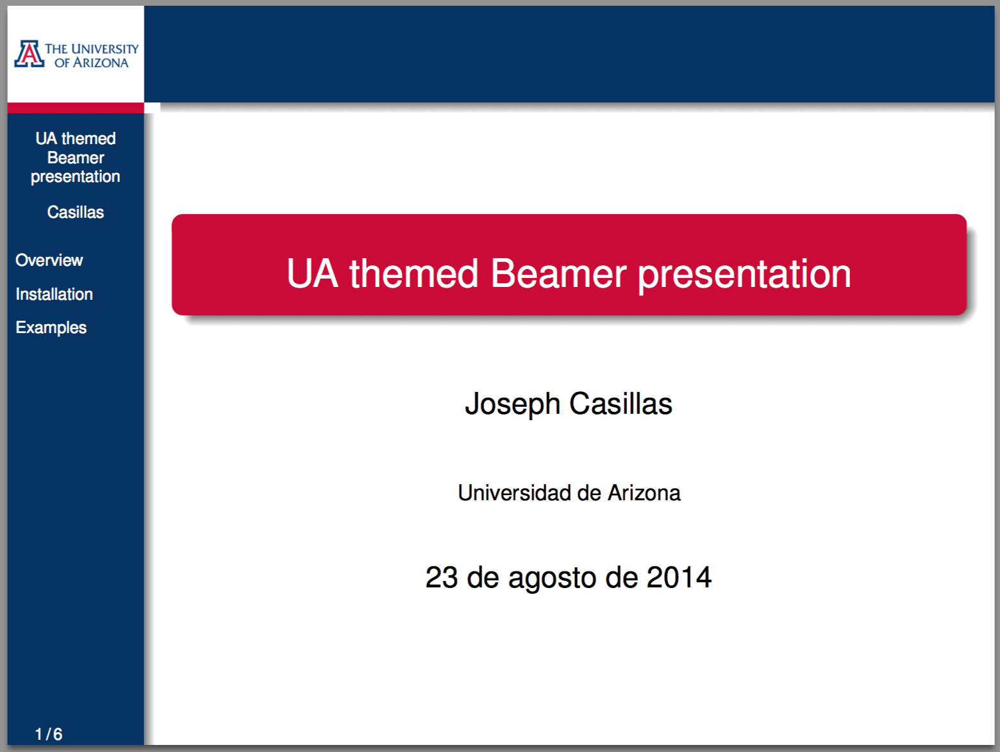
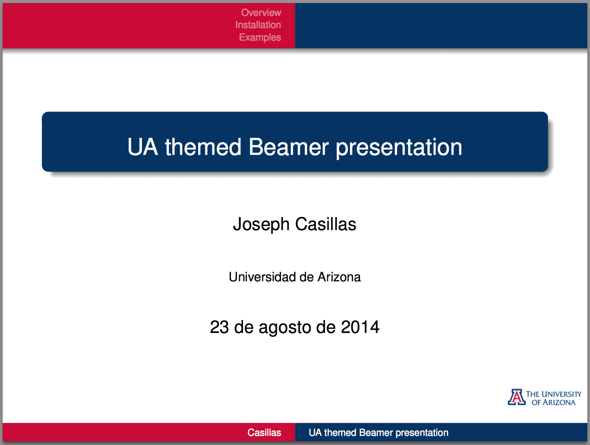
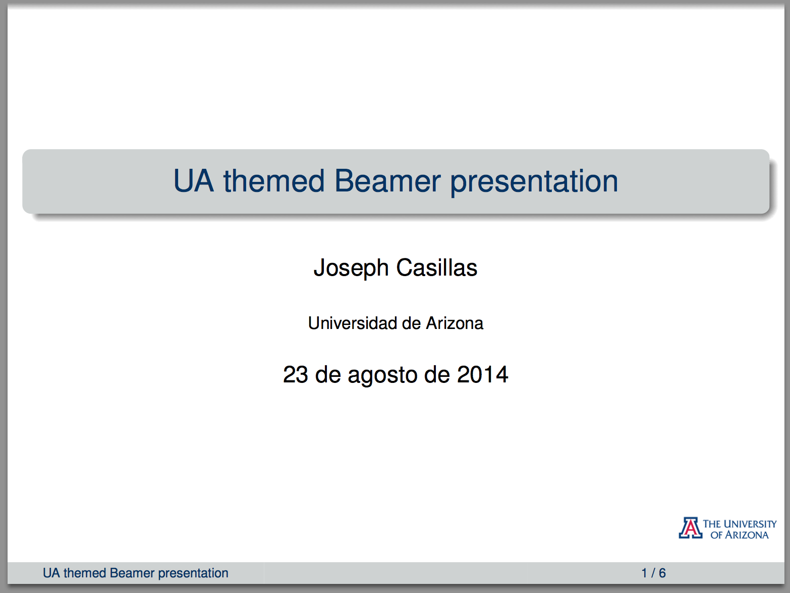

UA beamer slides
================

University of Arizona themed beamer slides for presentations in LaTeX.  
Based on the Warsaw, Palo Alto and UNL templates.  

- To change the style of the presentation change the "usetheme" option en the preamble
- There are 3 options:
    1. UA - Lateral column on the left side (red and blue) 
    2. UA2 - Bars on the top and bottom (red and blue) 
    3. UA3 - Bars on the top and bottom (grey, more formal) 

## Ex. UA

## Ex. UA2

##Ex. UA3

